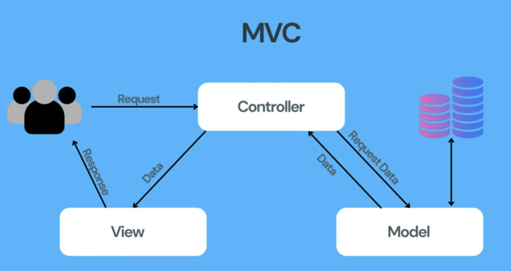
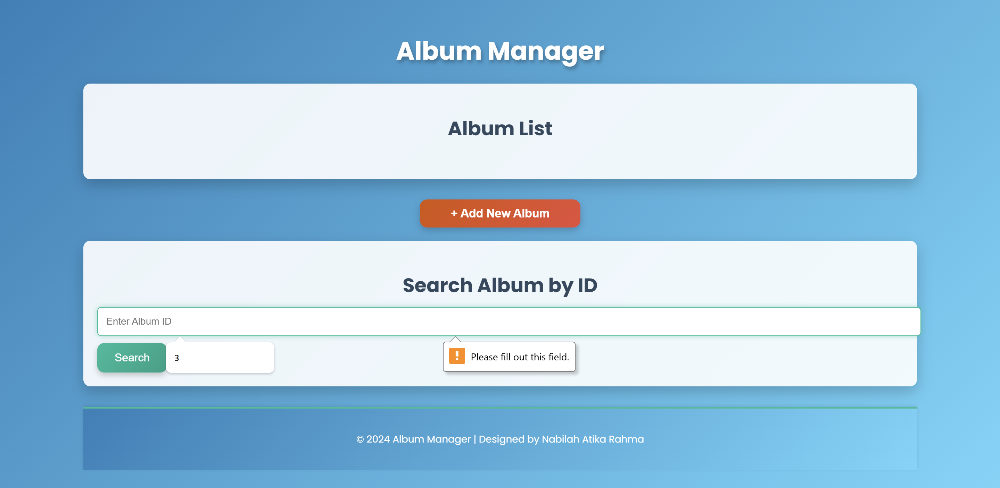

# Gin Framework

This project demonstrates how to build a RESTful web service API using Go and the Gin web framework.

# Intro to Gin Web Framework

This repository offers a straightforward example of using the [Go Tutorial](https://go.dev/doc/tutorial/web-service-gin) and the [Gin Framework](https://gin-gonic.com/) in Go. It demonstrates how to build a basic CRUD API for managing an album collection, inspired by the official Go tutorial. The project provides an easy-to-understand interface for handling album records, with features such as creating, retrieving all albums, and searching for a single album by ID. It uses JSON for data exchange, making it an ideal introduction for beginners to grasp the core concepts of Gin.



## Reading List 

- [Go Documentation](https://golang.org/doc/)
- [Go Example](https://gobyexample.com/)
- [Gin Documentation](https://github.com/gin-gonic/gin)
- [Web Service Gin](https://go.dev/doc/tutorial/web-service-gin)


## Getting Started

1. **Install [Go](https://go.dev/dl/), Gin Module, and Dependencies**
   ```
   go get github.com/gin-gonic/gin
   go mod tidy
   ```

2. **Clone this repository**

   ```
   git clone https://github.com/ranabel/Web-Application-Go/gin-13.git
   ```

3. **Start Server at http://localhost:8080**

   Start the server using:
   ```
   go run main.go
   ```

4. **Interact with the Endpoints**

   Router Setup - defines the following API routes

   - `GET /albums`: Fetch a list of all albums
   - `POST /albums`: Add a new album
   - `GET /albums/:id`: Fetch a specific detail album by ID

   Album Data Struct represents the data for each album

   - `id`: A unique identifier for the album.
   - `title`: The name of the album.
   - `artist`: The name of the artist or band.
   - `price`: The cost of the album.

   For this project, a slice of album structs is utilized to temporarily store the album data in memory. Use tools like [Postman](https://www.postman.com/) or curl to interact with the API. Here are some example endpoints you can test

   Example `POST` request to add an album:
   ```json
   {
     "id": "99",
     "title": "Album N",
     "artist": "El",
     "price": 53.00
   }
   ```
   use curl to make a request to your running web service
   $ curl http://localhost:8080/albums \
      --include \
      --header "Content-Type: application/json" \
      --request "POST" \
      --data '{"id": "4","title": "The Modern Sound of Betty Carter","artist": "Betty Carter","price": 49.99}'

   use curl to retrieve the full list of albums, which you can use to confirm that the new album was added.
   $ curl http://localhost:8080/albums \
    --header "Content-Type: application/json" \
    --request "GET"


## Screenshoot Initial Page 

   

## Conclusion

This project provides a simple example of building RESTful APIs using Go and the Gin Web Framework. It covers essential concepts such as retrieving, adding, and searching for data, and demonstrates how to connect the frontend with a backend API. By working through this project, you'll gain a solid understanding of the Gin framework, learn how to define routes and handle requests, become familiar with JSON serialization and deserialization in Go, and explore basic middleware implementation for logging and error handling.